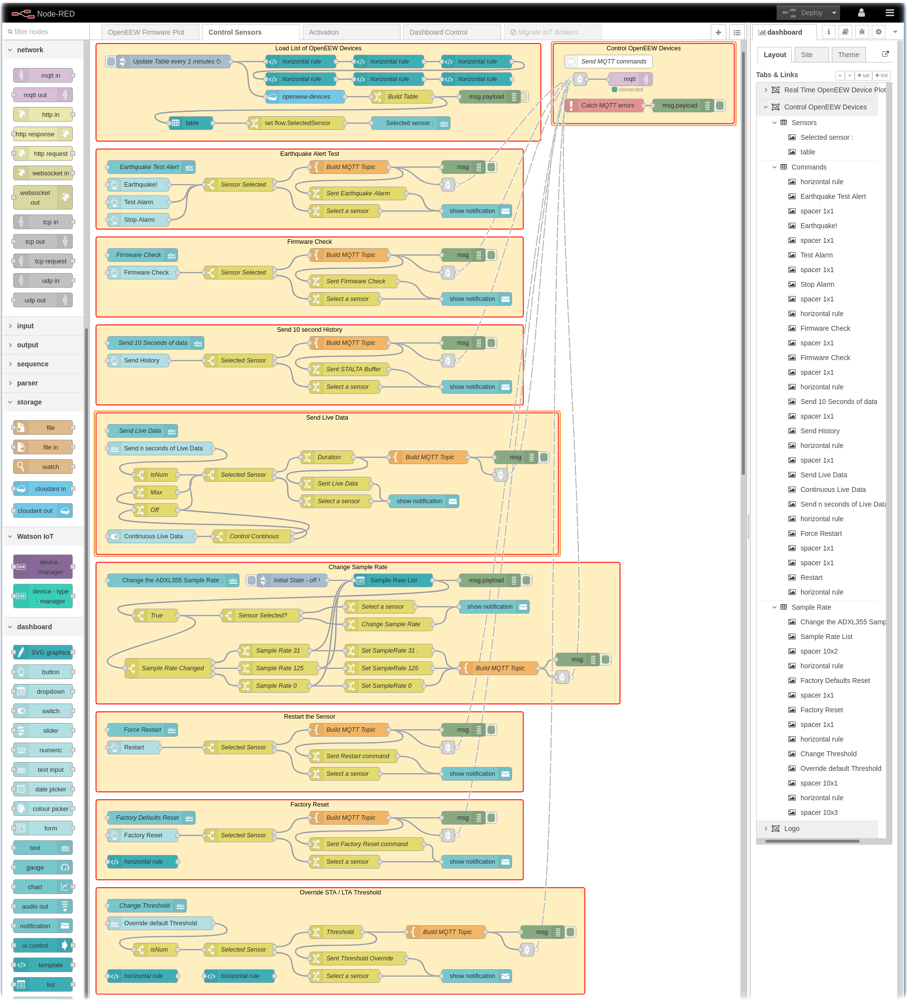
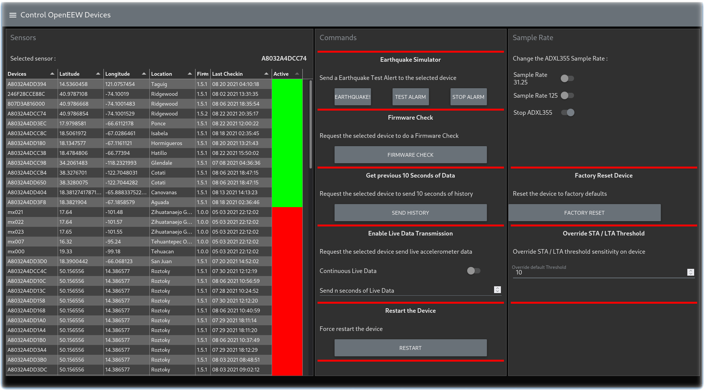
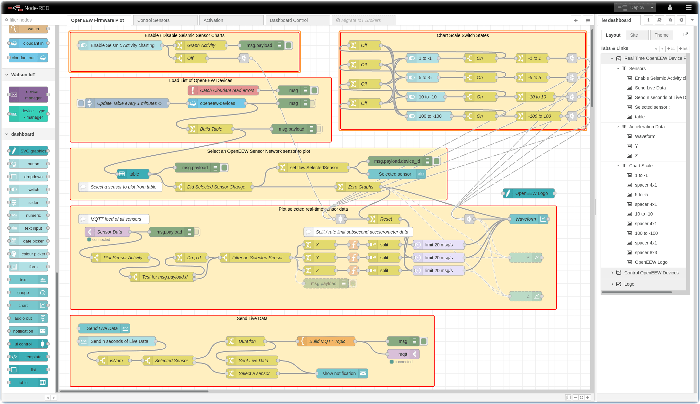
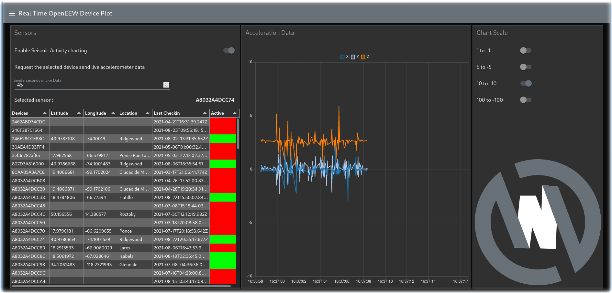

# OpenEEW Device Management - Node-RED

This set of Node-RED flows control the on-boarding and activation of OpenEEW
sensors, orchestrates the provisioning of sensors and provides a simple dashboard
for excerising the various MQTT command messages.

## Onboarding and Activation

Every time an OpenEEW sensor powers up it calls an API asking for its MQTT broker.
This Device Management service endpoint API is implemented by a Node-RED flow in this repo.
It replies with the MQTT hostname, the
[most current firmware version](https://github.com/openeew/openeew-firmware/releases)
and a URL where that firmware can be [downloaded](https://github.com/openeew/openeew-download) from.

The [OpenEEW sensor firmware](https://github.com/openeew/openeew-firmware) determines
if it needs to upgrade its firmware, otherwise, it makes a connection to the MQTT
broker.

Todos:

- Screenshot of the Node-RED flow
- Architectural diagram of how this Node-RED flow interacts with the OpenEEW sensors
- Describe the sections of the Node-RED flow and how they write data to Cloudant
- API implementation details

## Provisioning

When a new OpenEEW sensor is activated by the
[OpenEEW Provisioning mobile application](https://github.com/openeew/openeew-provisioner),
it collects geolocation information and ownership information from the mobile app and owner.
This information is sent to an API implemented by a Node-RED flow in this repo.
The metadata details are written / updated in a Cloudant database by this Node-RED flow.

Todos:

- Screenshot of the Node-RED flow
- Architectural diagram of how this Node-RED flow interacts with the OpenEEW Provisioner app
- Describe the sections of the Node-RED flow and how they write data to Cloudant
- API implementation details

## Send MQTT Commands to OpenEEW Sensors

This repo and Node-RED flow implements a simple Node-RED Dashboard to send MQTT commands
to the selected OpenEEW Sensor.  It excerises the MQTT topics described in the
[OpenEEW Firmware and MQTT readme](https://github.com/openeew/openeew-firmware/blob/main/FIRMWARE.md)



### Description of Node-RED flow Sections

- **Load List of OpenEEW Devices** : Read the online / offline status of the devices from the Cloudant DB, build a table array using JSONata, display the table of sensors, store the selected sensor in a flow variable.
- **Control OpenEEW Device** : Send the command via MQTT to the selected sensor.
- **Earthquake Alert Test** : Send `iot-2/type/OpenEEW/id/mac-address/cmd/earthquake/fmt/json` to the selected sensor.
- **Firmware Check** : Send `iot-2/type/OpenEEW/id/mac-address/cmd/firmwarecheck/fmt/json` to the selected sensor.
- **Send 10 second History** : Send `iot-2/type/OpenEEW/id/mac-address/cmd/10secondhistory/fmt/json` to the selected sensor.
- **Send Live Data** : Send `iot-2/type/OpenEEW/id/mac-address/cmd/sendacceldata/fmt/json` to the selected sensor.
- **Change Sample Rate** : Send `iot-2/type/OpenEEW/id/mac-address/cmd/samplerate/fmt/json` to the selected sensor.
- **Restart the Sensor** : Send `iot-2/type/OpenEEW/id/mac-address/cmd/forcerestart/fmt/json` to the selected sensor.
- **Factory Reset** : Send `iot-2/type/OpenEEW/id/mac-address/cmd/factoryreset/fmt/json` to the selected sensor.
- **Override STA / LTA Threshold** : Send `iot-2/type/OpenEEW/id/mac-address/cmd/threshold/fmt/json` to the selected sensor.

### Screenshot of the **Control OpenEEW Devices** dashboard



## OpenEEW Earthquake Accelometer Display

The main [OpenEEW Dashboard](https://dashboard.openeew.com/) is quite a bit more sophisticated but this
Node-RED flow implements a simple Node-RED dashboard to display accelometer readings from a selected
OpenEEW sensor.



### Description of Node-RED flow Sections

- **Enable / Disable Seismic Sensor Charts** : Display a switch that the admin can toggle on/off to control the graph and reset the chart.
- **Load List of OpenEEW Devices** : Read the online / offline status of the devices and build a table array using JSONata.
- **Select an OpenEEW Sensor Network sensor to plot** : Store the selected sensor in a flow variable if it has changed. Reset the chart.
- **Chart Scale Switch State** : a bunch of toggles that lets the admin choose the scale of the graph.
- **Plot selected real-time sensor data** : filter the incoming MQTT events for the selected sensor, transform the X/Y/Z arrays, split them into individual messages, reduce the volume of data, plot the seismic waveform on one graph (instead of three graphs)
- **Send Live Data** - Send a MQTT command to the selected sensor to start transmiting live data.

### Screenshot of the **Real Time OpenEEW Device Plot** dashboard



## Kubernetes Implementation

This repository contains a Makefile and Dockerfile which builds a Node-RED container that is
deployed to the OpenEEW infrastructure hosted by IBM Cloud Kubernetes Service (IKS).

### MQTT Secrets

Various MQTT secrets are required to run this containerized Node-RED flow.

## Building the openeew-devicemgmt Node-RED container

To build, run, test the OpenEEW DeviceMgmt Node-RED container on your local system:

```bash
make build
make run
make test
make ui
```

To push the Node-RED container to us.icr.io for deployment to the Kubernetes cluster:

```bash
make login
make push
make kube
```

### Contributors

<a href="https://github.com/openeew/openeew-devicemgmt-kube/graphs/contributors">
  
</a>
___

Enjoy! Give us [feedback](https://github.com/openeew/openeew-devicemgmt-kube/issues) if you have suggestions on how to improve this information.

## Contributing and Developer information

The community welcomes your involvement and contributions to this project. Please read the OpenEEW [contributing](https://github.com/openeew/openeew/blob/master/CONTRIBUTING.md) document for details on our code of conduct, and the process for submitting pull requests to the community.

## License

The OpenEEW sensor is licensed under the Apache Software License, Version 2. Separate third party code objects invoked within this code pattern are licensed by their respective providers pursuant to their own separate licenses. Contributions are subject to the [Developer Certificate of Origin, Version 1.1 (DCO)](https://developercertificate.org/) and the [Apache Software License, Version 2](http://www.apache.org/licenses/LICENSE-2.0.txt).
